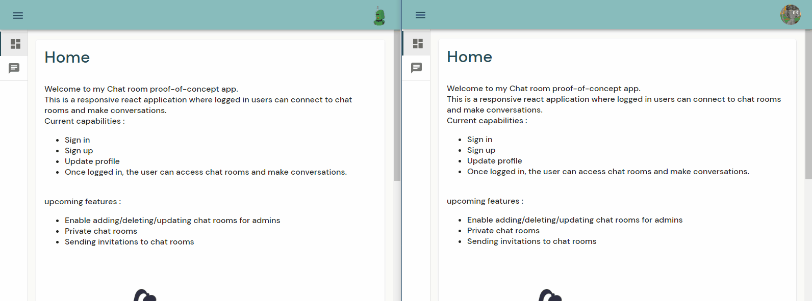

# Chat rooms




#### Welcome to Chat rooms app, an open-source chat platform!

### What is this website for?
I wanted to make a responsive website that contains a chat functionality using socket.io, where users can chat in different rooms.

### Why did you create this website?
I was always curious how chat apps work, so it was a great opportunity to discover the technologies behind this kind of app.

### What did you use to build this website?
I used React, Material-UI, socket.io, chat-ui-kit-react, Node.js, Express.js and Firebase. I'm planning on adding some features like login using google or facebook accounts and advanced chat features etc...

---

## How to run this web app locally

After cloning the repository onto your machine, navigate to the project's directory and install the dependencies for the backedn and front end using these commands: 
```console
cd back-end
npm install
cd .. 
cd front-end
npm install 
```
Now to run the project use:

```console
cd front-end
npm start 
cd ..
cd back-end
npm start
```

## Want to contribute?

Thank you! That would be great. Please feel free to send any pull requests here.
